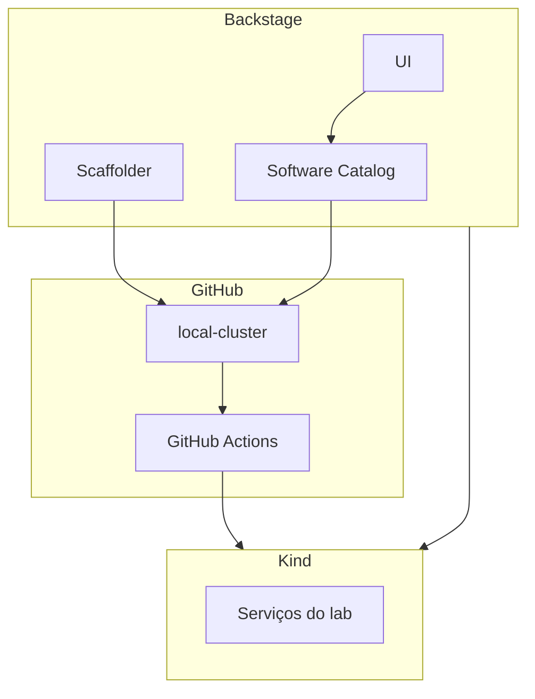

# Backstage

[Backstage](https://backstage.io/docs) é o portal de engenharia do lab: **Software Catalog**, Scaffolder (templates) e integrações (GitHub, Kubernetes). Neste repositório ficam os descritores do catálogo (`catalog-info.yaml`); a aplicação Backstage (`backstage-app`) é buildada à parte e implantada no cluster Kind.

Documentação relacionada: [`visao-geral.md`](./visao-geral.md), [`app-crm.md`](./app-crm.md), [`registry.md`](./registry.md), [`keycloak.md`](./keycloak.md), [`headlamp-oauth.md`](./headlamp-oauth.md), [`environment-oracle.md`](./environment-oracle.md).

---

## Arquitetura



| Camada | Função |
|--------|--------|
| **Software Catalog** | Inventário de software e dependências (YAML no Git) |
| **Scaffolder** | Templates que geram repositórios ou arquivos via actions |
| **GitHub** | Origem do catálogo (URL), API (token) e CI/CD (Actions); o Backstage não executa pipelines |

| Repositório | Conteúdo |
|-------------|----------|
| `Siluryan/local-cluster` (este) | `catalog-info.yaml`, entidades, módulo Terraform `infraestructure/modules/helm/backstage` |
| `backstage-app` (externo) | Monorepo Node (`packages/app`, `packages/backend`), `app-config.yaml`, build da imagem |

No cluster, o catálogo é carregado por URL do GitHub (`backstage_catalog_repo_url`), não por volume no pod.

---

## Software Catalog

### Tipos de entidade

| Kind | Uso no lab |
|------|------------|
| `Location` | Índice para outros YAML |
| `Component` | Software ou artefato (`crm-api`, módulo OKE como `library`) |
| `System` | Agrupamento (`local-cluster-lab`) |
| `Resource` | Dependência de infra (Keycloak, registry, …) |
| `User` / `Group` | Donos e times |
| `Template` | Scaffolder (futuro: `catalog/templates/`) |

`Component` = o que o time desenvolve ou opera; `Resource` = o que o software consome (IdP, registry, banco).

### Arquivos neste repositório

| Arquivo | Entidades |
|---------|-----------|
| `catalog-info.yaml` | `Location` raiz |
| `app/catalog-info.yaml` | `crm-api` |
| `infraestructure/modules/oke/catalog-info.yaml` | `terraform-oci-oke` |
| `catalog/entities.yaml` | `local-cluster-lab`, resources da plataforma |
| `catalog/users.yaml` | `User`, `Group` |

Anotações no CRM: `github.com/project-slug`, `backstage.io/source-location`.

URL padrão no cluster:

`https://github.com/Siluryan/local-cluster/raw/main/catalog-info.yaml`

---

## Deploy no Kind

Namespace `backstage`, provisionado por `infraestructure/modules/helm/backstage`.

### Recursos

| Recurso | Descrição |
|---------|-----------|
| `helm_release.postgresql` | PostgreSQL Bitnami; DB/usuário `backstage` |
| `kubernetes_deployment.backstage` | App Node (porta 7007); ConfigMap + Secret |
| `kubernetes_service.backstage` | ClusterIP 80 → 7007 |
| HTTPRoute / DNSEndpoint | `backstage.<cluster_domain>` |

Runtime: ConfigMap `app-config.kubernetes.yaml` (URLs, Postgres, catalog locations, auth, integrações).

Os YAML do catálogo devem estar no branch referenciado em `backstage_catalog_repo_url`.

### Variáveis Terraform

| Variável | Descrição |
|----------|-----------|
| `backstage_enabled` | Habilita o módulo |
| `backstage_postgres_password` | Senha do PostgreSQL |
| `backstage_image_repository` / `backstage_image_tag` | Imagem (padrão `backstage:latest`) |
| `backstage_image_pull_policy` | Ex.: `IfNotPresent` com `kind load` |
| `backstage_github_token` | PAT (opcional) |
| `backstage_github_oauth_client_id` / `backstage_github_oauth_client_secret` | OAuth (opcional) |
| `backstage_catalog_repo_url` | URL raw do `catalog-info.yaml` |

Exemplo em `infraestructure/environment/terraform.tfvars`:

```hcl
backstage_enabled           = true
backstage_postgres_password = "<senha>"
backstage_image_repository  = "backstage"
backstage_image_tag         = "latest"
backstage_image_pull_policy = "IfNotPresent"
```

```bash
cd infraestructure/environment
terraform apply -target=module.helm.module.backstage
```

### Imagem

```bash
./scripts/backstage-build-kind.sh
```

Executa `yarn build:backend`, `yarn build-image` e `kind load docker-image backstage:latest --name local-cluster`.

Alternativa via registry do lab:

```bash
docker tag backstage registry.<cluster_domain>/backstage:latest
docker push registry.<cluster_domain>/backstage:latest
```

Ajustar `backstage_image_*` e `image_pull_policy` conforme o registry.

### Acesso

Port-forward:

```bash
kubectl -n backstage port-forward svc/backstage 7007:80
```

`http://localhost:7007` — frontend e API no mesmo processo.

URL pública: `https://backstage.<cluster_domain>` (Envoy + Cloudflare Tunnel).

### Operação

```bash
kubectl -n backstage get pods
kubectl -n backstage logs deploy/backstage --tail=100
```

| Sintoma | Verificação |
|---------|-------------|
| `ImagePullBackOff` | Imagem no Kind ou credencial do registry |
| Crash por banco | Pod `backstage-postgresql`; Secret vs ConfigMap |
| Catálogo vazio | `backstage_catalog_repo_url` acessível; YAML no Git |
| Login GitHub `NotFoundError` | `User` em `catalog/users.yaml` com `metadata.name` = username GitHub |

Auth padrão sem OAuth: provider **guest**.

---

## Integração GitHub

| Mecanismo | Uso |
|---------|-----|
| `integrations.github[].token` (PAT) | API GitHub (repos, PRs, Scaffolder) |
| `auth.providers.github` (OAuth) | Login na UI |
| `github.com/project-slug` | Liga Component ao repositório |
| `usernameMatchingUserEntityName` | `User` no catálogo com mesmo `metadata.name` que o username GitHub |

### Personal Access Token

GitHub → Settings → Developer settings → Personal access tokens. Escopos típicos: `repo`; `workflow:read` para Actions.

**Local** — `backstage-app/app-config.local.yaml` (modelo em `app-config.local.yaml.example`):

```yaml
integrations:
  github:
    - host: github.com
      token: ghp_<token>
```

**Kind** — `terraform.tfvars`:

```hcl
backstage_github_token = "ghp_<token>"
```

### OAuth App

| Campo | Local | Cluster |
|-------|-------|---------|
| Homepage | `http://localhost:3000` | `https://backstage.<cluster_domain>` |
| Callback | `http://localhost:7007/api/auth/github/handler/frame` | `https://backstage.<cluster_domain>/api/auth/github/handler/frame` |

**Local:**

```yaml
auth:
  providers:
    github:
      development:
        clientId: <id>
        clientSecret: <secret>
```

**Kind:**

```hcl
backstage_github_oauth_client_id     = "<id>"
backstage_github_oauth_client_secret = "<secret>"
```

Backend: `@backstage/plugin-auth-backend-module-github-provider`. UI: `packages/app/src/modules/signIn/` (`guest` + `github`).

### OIDC via Keycloak

Alternativa ao OAuth GitHub: mesmo padrão do Headlamp ([`headlamp-oauth.md`](./headlamp-oauth.md)). Não configurado por padrão.

---

## Desenvolvimento local

Opcional; o cenário principal é o deploy no Kind.

Requisitos: Node 22 ou 24, Yarn 4 (`corepack enable` após `nvm use 22`).

```bash
export NVM_DIR="$HOME/.nvm" && . "$NVM_DIR/nvm.sh" && nvm use 22 && corepack enable
cd ~/Documentos/backstage-app
yarn install
yarn start
```

| Endpoint | URL |
|----------|-----|
| UI | `http://localhost:3000` |
| Backend | `http://localhost:7007` |

Catálogo local: em `app-config.yaml`, location `file` → `../../../local-cluster/catalog-info.yaml`.

Sem `yarn` no PATH: `node .yarn/releases/yarn-4.4.1.cjs start`. Não usar `apt install cmdtest`.

`yarn install` do scaffold pode demorar; `node_modules/.yarn-state.yml` indica conclusão.

---

## CI/CD

Pipelines no **GitHub Actions**; o Backstage pode exibir runs (plugin) ou gerar workflows via Scaffolder. O CRM ainda não tem `.github/workflows/` — ver [`app-crm.md`](./app-crm.md) e [`registry.md`](./registry.md).

---

## Referências

- [Backstage](https://backstage.io/docs)
- [Formato de entidades](https://backstage.io/docs/features/software-catalog/descriptor-format)
- [Software Templates](https://backstage.io/docs/features/software-templates/)
- [Auth — GitHub](https://backstage.io/docs/auth/github/provider)
